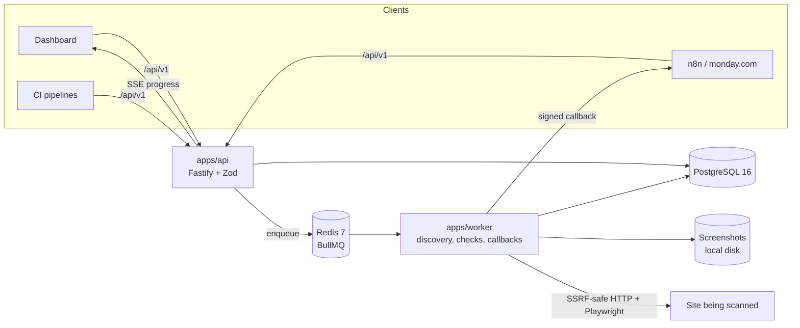

# QA Hub

QA Hub validates live websites after launch. Submit a URL (from the dashboard, n8n, monday.com via n8n, or CI) and it assigns a scan ID, discovers every page, runs checks in the background, streams progress, and produces a report.

> **Status: Phase 1 of 6 (foundation).** The monorepo, database schema, shared API contract, progress and health-score logic, API skeleton (`/health`, `/ready`, OpenAPI), worker skeleton (stale-scan reaper), web shell, Docker Compose, and CI are in place. Scans, auth, and the dashboard arrive in the phases listed in [docs/PLAN.md](docs/PLAN.md). This README describes what exists today.

## Quick start

### With Docker

```bash
cp .env.example .env
# Set WEBHOOK_SIGNING_SECRET (openssl rand -hex 32) and SEED_ADMIN_PASSWORD in .env
docker compose up --build
docker compose exec api pnpm db:seed     # create the first admin
open http://localhost:8080               # web app
open http://localhost:8080/api/docs      # OpenAPI docs
```

### Without Docker (Windows, macOS, Linux)

Requires Node 22 and pnpm 10. Postgres 16 and Redis run from the repo, no installation needed.

```bash
pnpm install
pnpm dev:services        # embedded Postgres :5432 and Redis :6379, keep this running
cp .env.example .env
pnpm db:migrate
pnpm db:seed
pnpm dev                 # api :3000, worker, web :5173
```

`pnpm dev:services` needs a `redis-server` binary. It looks for `REDIS_SERVER_BIN`, then `.tools/redis/`, then `PATH`.

## Architecture



| Package | Purpose |
| --- | --- |
| `apps/api` | Public `/api/v1` API, sessions and API keys, OpenAPI at `/api/docs` |
| `apps/worker` | BullMQ consumers, scan engine, stale-scan reaper |
| `apps/web` | React 19 dashboard |
| `packages/shared` | Zod schemas (the API contract), progress and ETA maths, health score, URL utilities, env parsing |
| `packages/db` | Prisma schema, migrations, client, admin seed |
| `packages/testkit` | Embedded Postgres, Redis and per-test databases for the test suite |

## Commands

| Command | Does |
| --- | --- |
| `pnpm build` | Build every package |
| `pnpm typecheck` | `tsc --noEmit` everywhere |
| `pnpm lint` | ESLint and Prettier check |
| `pnpm test` | Unit and integration tests (starts its own Postgres and Redis if none are configured) |
| `pnpm dev` | Watch mode for api, worker and web |
| `pnpm db:migrate` | Apply migrations |
| `pnpm db:seed` | Create the first admin from `SEED_ADMIN_*` |

## Configuration

Every variable is documented in [.env.example](.env.example).

## API walkthrough

Available now:

```bash
curl -s http://localhost:8080/api/v1/health
# {"status":"ok"}

curl -s http://localhost:8080/api/v1/ready
# {"status":"ready","checks":{"database":"ok","redis":"ok"}}

curl -s http://localhost:8080/api/docs/json | jq '.openapi'
# "3.1.0"
```

## Decisions and plan

- [docs/PLAN.md](docs/PLAN.md): phases and design points
- [docs/DECISIONS.md](docs/DECISIONS.md): choices made where the spec was open
