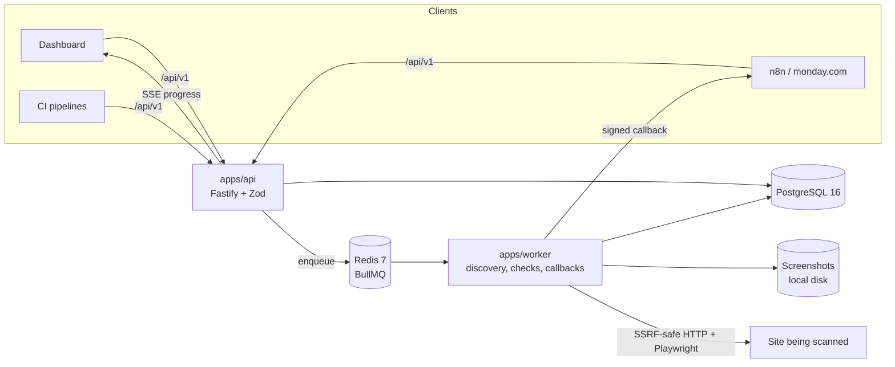

# QA Hub

QA Hub validates live websites after launch. Submit a URL (from the dashboard, n8n, monday.com via n8n, or CI) and it assigns a scan ID, discovers every page, runs checks in the background, streams progress, and produces a report.

> **Status: Phase 2 of 6 (API core).** The public API works end to end: sign in, API keys with scopes, allowed domains, scan creation with idempotency and duplicate protection, scan status and progress, pages, issues, cancel, settings, and an OpenAPI 3.1 document. Scans are accepted and queued but not yet executed. The scan engine arrives in Phase 3 and the dashboard in Phase 4. See [docs/PLAN.md](docs/PLAN.md). This README describes what exists today.

## Quick start

### With Docker

```bash
cp .env.example .env
# Set WEBHOOK_SIGNING_SECRET (openssl rand -hex 32) and SEED_ADMIN_PASSWORD in .env
docker compose up --build
docker compose exec api pnpm db:seed     # create the first admin
open http://localhost:8080               # web app
open http://localhost:8080/api/docs      # OpenAPI docs
```

### Without Docker (Windows, macOS, Linux)

Requires Node 22 and pnpm 10. Postgres 16 and Redis run from the repo, no installation needed.

```bash
pnpm install
pnpm dev:services        # embedded Postgres :5432 and Redis :6379, keep this running
cp .env.example .env
pnpm db:migrate
pnpm db:seed
pnpm dev                 # api :3000, worker, web :5173
```

`pnpm dev:services` needs a `redis-server` binary. It looks for `REDIS_SERVER_BIN`, then `.tools/redis/`, then `PATH`.

## Architecture



| Package | Purpose |
| --- | --- |
| `apps/api` | Public `/api/v1` API, sessions and API keys, OpenAPI at `/api/docs` |
| `apps/worker` | BullMQ consumers, scan engine, stale-scan reaper |
| `apps/web` | React 19 dashboard |
| `packages/shared` | Zod schemas (the API contract), progress and ETA maths, health score, URL utilities, env parsing |
| `packages/net` | SSRF guard: rejects loopback, private, link-local and cloud metadata addresses |
| `packages/db` | Prisma schema, migrations, client, admin seed |
| `packages/testkit` | Embedded Postgres, Redis and per-test databases for the test suite |

## Commands

| Command | Does |
| --- | --- |
| `pnpm build` | Build every package |
| `pnpm typecheck` | `tsc --noEmit` everywhere |
| `pnpm lint` | ESLint and Prettier check |
| `pnpm test` | Unit and integration tests (starts its own Postgres and Redis if none are configured) |
| `pnpm dev` | Watch mode for api, worker and web |
| `pnpm db:migrate` | Apply migrations |
| `pnpm db:seed` | Create the first admin from `SEED_ADMIN_*` |

## Configuration

Every variable is documented in [.env.example](.env.example).

## API walkthrough

Interactive docs live at `/api/docs` and the OpenAPI 3.1 document at `/api/docs/json`, ready to import into n8n or Postman. Set `BASE` to your deployment, for example `http://localhost:8080` with Docker or `http://localhost:3000` in dev.

```bash
BASE=http://localhost:3000

# 1. Sign in as the seeded admin (session cookie, used by the dashboard and for admin actions)
curl -s -c jar.txt -H 'content-type: application/json' \
  -d '{"email":"admin@example.com","password":"<SEED_ADMIN_PASSWORD>"}' $BASE/api/v1/auth/login

# 2. Allow a site. Entries starting with *. match the apex and every subdomain.
curl -s -b jar.txt -H 'content-type: application/json' \
  -d '{"hostname":"*.example.com","note":"Client site"}' $BASE/api/v1/allowed-domains

# 3. Create an API key for n8n or CI. The raw key is shown once, so copy it now.
curl -s -b jar.txt -H 'content-type: application/json' \
  -d '{"name":"n8n production","scopes":["scans:read","scans:write"]}' $BASE/api/v1/api-keys
KEY=qah_...   # the "key" field from the response

# 4. Start a scan. Repeating the Idempotency-Key returns the same scan.
curl -s -H "authorization: Bearer $KEY" -H 'content-type: application/json' \
  -H 'idempotency-key: monday-item-1234567890' \
  -d '{"url":"https://www.example.com","metadata":{"mondayItemId":"1234567890"}}' $BASE/api/v1/scans
# 202 {"id":"scn_...","status":"queued","statusUrl":"...","reportUrl":"..."}

# 5. Poll status and progress
curl -s -H "authorization: Bearer $KEY" $BASE/api/v1/scans/scn_...

# 6. Read findings. groupBy=fingerprint collapses identical issues across pages.
curl -s -H "authorization: Bearer $KEY" "$BASE/api/v1/scans/scn_.../issues?severity=critical&groupBy=fingerprint"

# 7. Cancel
curl -s -X POST -H "authorization: Bearer $KEY" $BASE/api/v1/scans/scn_.../cancel
```

Errors always have the shape `{ "error": { "code", "message", "details"? } }`:

| Status | Code | When |
| --- | --- | --- |
| 400 | `validation_error`, `bad_request` | Malformed body, query or cursor |
| 401 | `unauthorized` | Missing, invalid or revoked credentials |
| 403 | `forbidden` | Missing scope (for example `forms:submit`), or an admin-only route |
| 404 | `not_found` | Unknown scan, issue or route |
| 409 | `conflict` | The hostname already has a queued or running scan. `details.scan` holds it. |
| 422 | `domain_not_allowed`, `url_blocked` | Host not on the allowed list, or it resolves to a private address |
| 429 | `rate_limited` | Over the per-key limit. See the `Retry-After` header. |

Every response carries an `X-Request-Id` header.

## Decisions and plan

- [docs/PLAN.md](docs/PLAN.md): phases and design points
- [docs/DECISIONS.md](docs/DECISIONS.md): choices made where the spec was open
