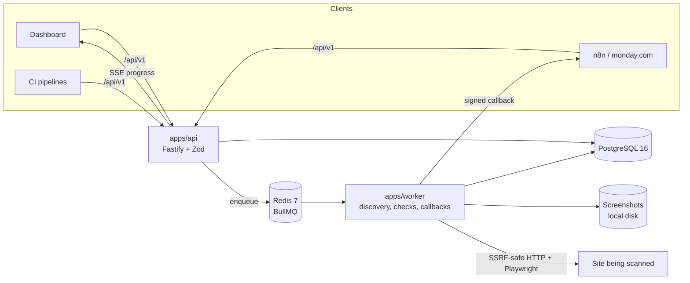

# QA Hub

QA Hub validates live websites after launch. Submit a URL (from the dashboard, n8n, monday.com via n8n, or CI) and it assigns a scan ID, discovers every page, runs checks in the background, streams progress, and produces a report.

> **Status: Phase 4 of 6 (web app).** You can sign in, start scans, watch them run and read the report in the dashboard. The `images`, `links`, `staging-urls` and `page-health` checks are live. The `forms` and `seo` checks arrive in Phase 5, and callbacks, live SSE updates, CSV/PDF export and the command palette in Phase 6. See [docs/PLAN.md](docs/PLAN.md). This README describes what exists today.

## Quick start

### With Docker

```bash
cp .env.example .env
# Set WEBHOOK_SIGNING_SECRET (openssl rand -hex 32) and SEED_ADMIN_PASSWORD in .env
docker compose up --build
docker compose exec api pnpm db:seed     # create the first admin
open http://localhost:8080               # web app
open http://localhost:8080/api/docs      # OpenAPI docs
```

### Without Docker (Windows, macOS, Linux)

Requires Node 22 and pnpm 10. Postgres 16 and Redis run from the repo, no installation needed.

```bash
pnpm install
pnpm dev:services        # embedded Postgres :5432 and Redis :6379, keep this running
cp .env.example .env
pnpm db:migrate
pnpm db:seed
pnpm dev                 # api :3000, worker, web :5173
```

`pnpm dev:services` needs a `redis-server` binary. It looks for `REDIS_SERVER_BIN`, then `.tools/redis/`, then `PATH`.

The worker drives Chromium. Install it once with `pnpm --filter @qa-hub/worker exec playwright install chromium` (the Docker image does this for you).

### The dashboard

Open http://localhost:5173 and sign in with the seeded admin. In development the Vite server proxies `/api` to the API on `127.0.0.1:3000` (override with `VITE_API_TARGET`), so the session cookie and the CSRF check behave as they do in production.

| Screen | What it does |
| --- | --- |
| Scans | Start a scan, search and filter, see live progress for active scans, open a report |
| Scan in progress | Percentage, phase, pages per minute, elapsed time, estimated finish, and issues as they are found. Cancel with confirmation |
| Report | Health score with change since the last scan, score trend, findings by check, and issues by page or grouped across pages. Each issue has its evidence and a screenshot. Ignore or reopen issues |
| Settings | Create and revoke API keys (shown once), allowed domains, the webhook signing secret, scan defaults. Non-admins see the defaults read-only |

The dashboard follows scans by polling once a second while a scan is active. Live server-sent events replace this in Phase 6.

### Try a scan on the fixture site

The repo ships a small site with deliberate defects. It is the only thing you should scan while developing.

```bash
pnpm --filter @qa-hub/fixtures serve   # http://127.0.0.1:4010
# In .env set ALLOW_LOCAL_TARGETS=true, allow 127.0.0.1 (step 2 of the API walkthrough), then start a scan of http://127.0.0.1:4010
```

See [fixtures/site/README.md](fixtures/site/README.md) for what is wrong with each page.

## Architecture



| Package | Purpose |
| --- | --- |
| `apps/api` | Public `/api/v1` API, sessions and API keys, OpenAPI at `/api/docs` |
| `apps/worker` | Scan engine: discovery, browser pool, checks, link verification, progress, stale-scan reaper |
| `apps/web` | React 19 dashboard: Vite, React Router, TanStack Query, Tailwind, Radix, Recharts |
| `packages/shared` | Zod schemas (the API contract), progress and ETA maths, health score, URL utilities, env parsing |
| `packages/net` | SSRF guard and the HTTP client for every user-supplied URL: DNS pinning, redirect re-checks, size and time limits |
| `packages/storage` | Storage interface with a local disk implementation, used for screenshots |
| `fixtures/site` | Deterministic site with known defects, used by tests and for manual trials |
| `packages/db` | Prisma schema, migrations, client, admin seed |
| `packages/testkit` | Embedded Postgres, Redis and per-test databases for the test suite |

## Commands

| Command | Does |
| --- | --- |
| `pnpm build` | Build every package |
| `pnpm typecheck` | `tsc --noEmit` everywhere |
| `pnpm lint` | ESLint and Prettier check |
| `pnpm test` | Unit and integration tests (starts its own Postgres and Redis if none are configured) |
| `pnpm dev` | Watch mode for api, worker and web |
| `pnpm --filter @qa-hub/web test` | Web component and page tests (Vitest, Testing Library, jsdom) |
| `pnpm db:migrate` | Apply migrations |
| `pnpm db:seed` | Create the first admin from `SEED_ADMIN_*` |

## Configuration

Every variable is documented in [.env.example](.env.example).

## API walkthrough

Interactive docs live at `/api/docs` and the OpenAPI 3.1 document at `/api/docs/json`, ready to import into n8n or Postman. Set `BASE` to your deployment, for example `http://localhost:8080` with Docker or `http://localhost:3000` in dev.

```bash
BASE=http://localhost:3000

# 1. Sign in as the seeded admin (session cookie, used by the dashboard and for admin actions)
curl -s -c jar.txt -H 'content-type: application/json' \
  -d '{"email":"admin@example.com","password":"<SEED_ADMIN_PASSWORD>"}' $BASE/api/v1/auth/login

# 2. Allow a site. Entries starting with *. match the apex and every subdomain.
curl -s -b jar.txt -H 'content-type: application/json' \
  -d '{"hostname":"*.example.com","note":"Client site"}' $BASE/api/v1/allowed-domains

# 3. Create an API key for n8n or CI. The raw key is shown once, so copy it now.
curl -s -b jar.txt -H 'content-type: application/json' \
  -d '{"name":"n8n production","scopes":["scans:read","scans:write"]}' $BASE/api/v1/api-keys
KEY=qah_...   # the "key" field from the response

# 4. Start a scan. Repeating the Idempotency-Key returns the same scan.
curl -s -H "authorization: Bearer $KEY" -H 'content-type: application/json' \
  -H 'idempotency-key: monday-item-1234567890' \
  -d '{"url":"https://www.example.com","metadata":{"mondayItemId":"1234567890"}}' $BASE/api/v1/scans
# 202 {"id":"scn_...","status":"queued","statusUrl":"...","reportUrl":"..."}

# 5. Poll status and progress
curl -s -H "authorization: Bearer $KEY" $BASE/api/v1/scans/scn_...

# 6. Read findings. groupBy=fingerprint collapses identical issues across pages.
curl -s -H "authorization: Bearer $KEY" "$BASE/api/v1/scans/scn_.../issues?severity=critical&groupBy=fingerprint"

# 7. Cancel
curl -s -X POST -H "authorization: Bearer $KEY" $BASE/api/v1/scans/scn_.../cancel
```

Errors always have the shape `{ "error": { "code", "message", "details"? } }`:

| Status | Code | When |
| --- | --- | --- |
| 400 | `validation_error`, `bad_request` | Malformed body, query or cursor |
| 401 | `unauthorized` | Missing, invalid or revoked credentials |
| 403 | `forbidden` | Missing scope (for example `forms:submit`), or an admin-only route |
| 404 | `not_found` | Unknown scan, issue or route |
| 409 | `conflict` | The hostname already has a queued or running scan. `details.scan` holds it. |
| 422 | `domain_not_allowed`, `url_blocked` | Host not on the allowed list, or it resolves to a private address |
| 429 | `rate_limited` | Over the per-key limit. See the `Retry-After` header. |

Every response carries an `X-Request-Id` header.

## How a scan runs

1. **Discovery.** Status `discovering`. Reads `robots.txt` and `sitemap.xml` (following indexes) and crawls from the homepage, up to `MAX_PAGES`. The page total is fixed when discovery ends.
2. **Pages.** Status `running`. `PAGE_CONCURRENCY` pages at a time in Chromium. Each page is loaded, scrolled to the bottom to trigger lazy loading, then every enabled check runs. Findings are written as they are found, with a screenshot for each critical one.
3. **Links.** Every unique link on the site is verified once (HEAD, then GET if the server refuses HEAD). A broken link becomes one finding per page that contains it.
4. **Finalise.** Health score and per-check results, then `completed`.

Cancelling a scan stops queued work and closes the browser within a page or two. At most `MAX_CONCURRENT_SCANS` scans run at once and the rest wait as `queued`. Each scan sends at most `SCAN_RATE_LIMIT_RPS` requests a second to the site and backs off on 429 and 503.

| Check | Finds |
| --- | --- |
| `images` | Broken images (including lazy-loaded ones), broken `srcset` candidates and CSS backgrounds, missing `alt` |
| `links` | Broken internal and external links, redirect chains of three or more hops |
| `staging-urls` | Links, images, scripts, styles, canonicals and requests pointing at staging or development hosts |
| `page-health` | Non-2xx pages, JavaScript errors, failed requests, mixed content |

Screenshots are served at `GET /api/v1/scans/:id/issues/:issueId/screenshot`.

## Decisions and plan

- [docs/PLAN.md](docs/PLAN.md): phases and design points
- [docs/DECISIONS.md](docs/DECISIONS.md): choices made where the spec was open
